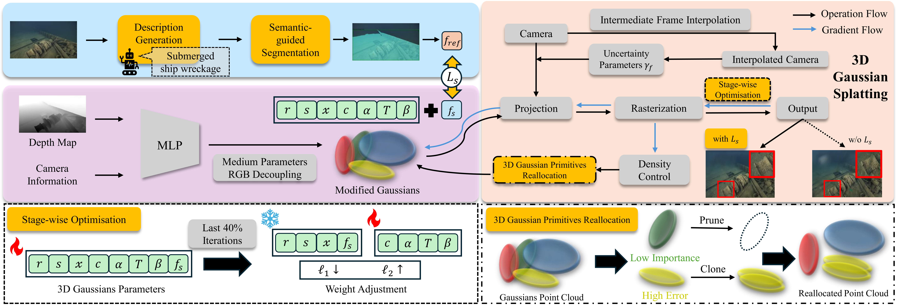

# SWAGSplatting: Semantic-guided Water-scene Augmented Gaussian Splatting

[](https://arxiv.org/pdf/2509.00800)




## 1. Configuration

- **Python Version**: *3.12.9*
- **CUDA Version**: *12.8* 
- **PyTorch Version**: *2.5.1*
- **Torchvision Version**: *0.20.1*
- **Torchaudio Version**: *2.5.1*
- **Graphics Card**: RTX 4090, 24GB

## 2. Setup

Please refer to the documentation `README.md` from the [3D Gaussian Splatting repo](https://github.com/graphdeco-inria/gaussian-splatting).

## 3. Dataset

- **Download**: The full dataset used in this paper can be downloaded [here](https://drive.google.com/file/d/1H3JH3zZNQecrQ8BPCsgvCzCu_xmpmJHV/view?usp=sharing), along with all the necessary pre-process data.
- **Processing your own scene**:
  - Please refer to the [Processing your own scenes](https://github.com/graphdeco-inria/gaussian-splatting?tab=readme-ov-file#processing-your-own-scenes) section from 3D Guassian Splatting.
  - The depth maps are generated from [Depth-Anything-V2](https://github.com/DepthAnything/Depth-Anything-V2).
    - **Note on Generating Depth Maps**: Since the depth info output by the Depth-Anything-V2 is opposite to what our model expects, add the following line before *line 63* in [run.py](https://github.com/DepthAnything/Depth-Anything-V2/blob/main/run.py) to flip the depth values:
      ```
      depth = 255.0 - depth
      ```
      and add the following flags:
      ```
      --pred-only --grayscale
      ```
  - The `images` folder follows the instructions from the [RUSplatting](https://github.com/theflash987/RUSplatting) repo.
  - The final structure of your own scene should be like this
    ```
    <your_dataset>
    |---depthmap
    |---distorted
    |---images
    |---input
    |---masked
    |---sparse
    |---stereo
    |---prompt.txt
    |---output.json
    ```
    - `prompt.txt` stores the captions for each image. These captions are generated with [BLIP-3o](https://github.com/JiuhaiChen/BLIP3o/tree/main) and are used as the per-image text descriptions. *However, this txt file can be ignored as it is not explicitly used in the code.*
    - The images in the `masked` folder are mask images generated by [Grounded-Segment-Anything](https://github.com/IDEA-Research/Grounded-Segment-Anything) using each image’s caption.
    - `output.json` stores per-image segmentation labels and bounding boxes. During training it is loaded to precompute CLIP text embeddings for each label, then those region embeddings are used to provide semantic supervision for the Gaussians.


## 4. Training Flags

### `--stage <value>`
- **Purpose**: Set the number of iterations when the second stage of optimization should begin.
- **Type**: int (e.g., 12000 as recommended)
- **Default**: None
